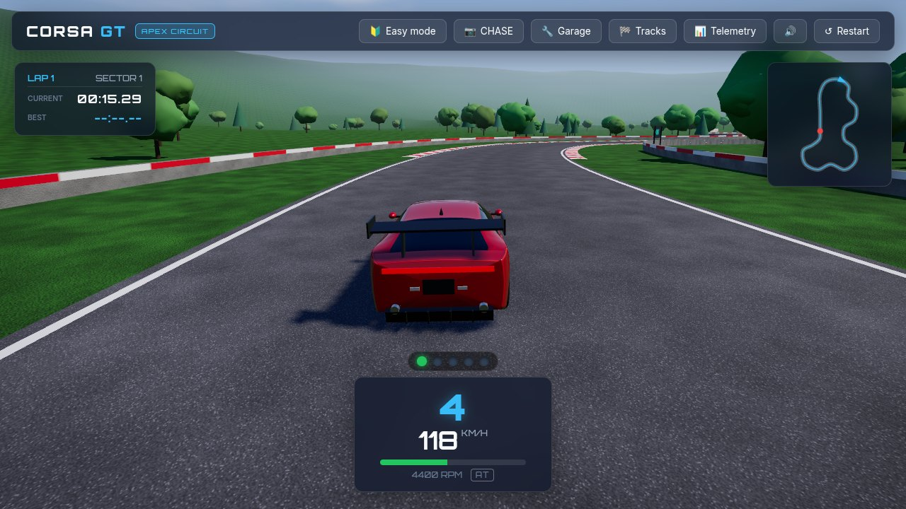
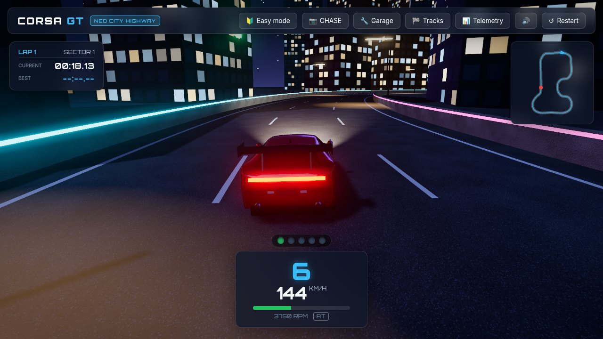
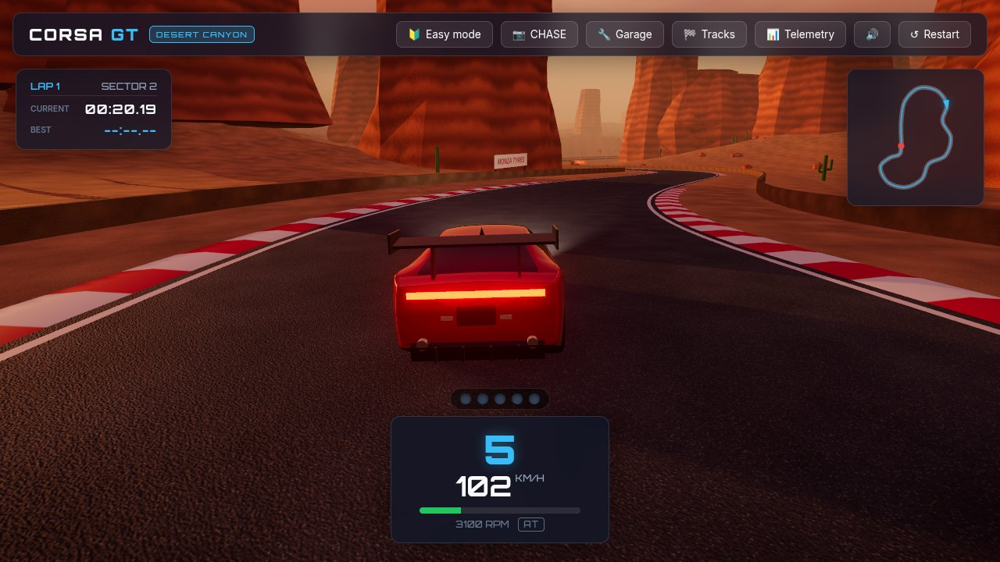
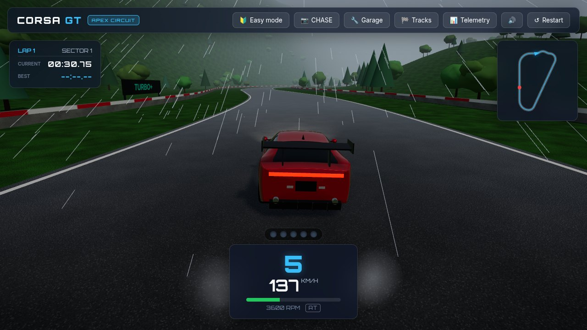
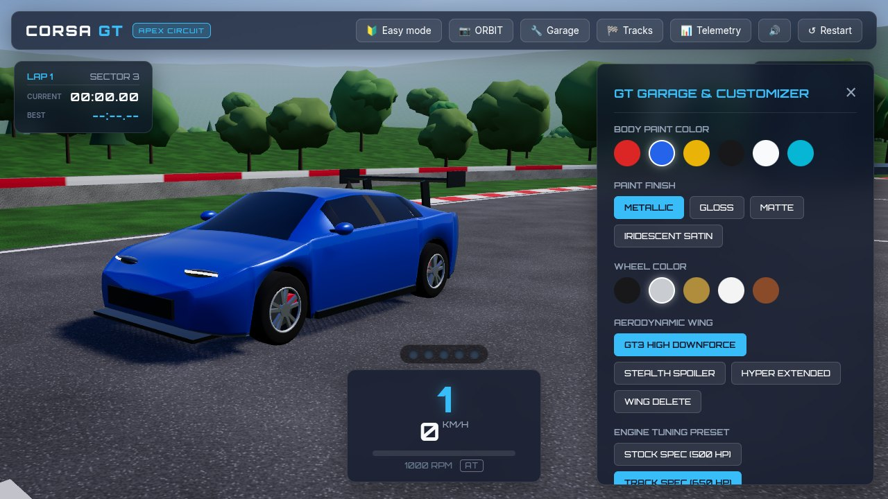
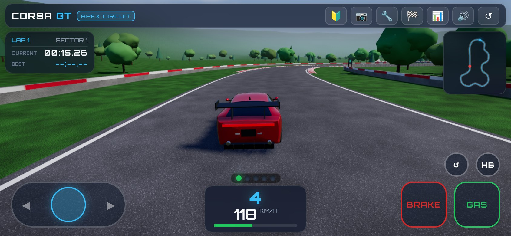

# Corsa GT

English | [日本語](README.ja.md)

A 3D GT racing and driving game that runs in the browser. Built with [Three.js](https://threejs.org/) and [Vite](https://vite.dev/); every model, texture and sound is generated in code, so there are no asset files to download.



| Neo City Highway at midnight | Desert Canyon at sunset |
| :---: | :---: |
|  |  |
| **Rain at Apex Circuit** | **Garage** |
|  |  |

On a phone in landscape:



## Features

- **Three circuits** — a high-speed parkland circuit with two kilometre-long straights (Apex Circuit), a neon street circuit at night (Neo City Highway) and a canyon road with elevation changes (Desert Canyon).
- **Time of day and weather** — noon, sunset or midnight, clear or rain. Rain makes the road wet and reflective and reduces grip.
- **Driving model** — the tyres really do slip, with a 6-speed gearbox (automatic or manual), surface-dependent grip and solid barriers.
- **Two assist levels** — *Easy* brakes for corners and steers back to the road when you let go of the wheel; *Normal* leaves you with ABS and light traction control.
- **Four cameras** — chase, hood, cockpit and a free orbit view.
- **Garage** — body colour, paint finish, wheel colour, rear wing and engine tune.
- **Plays on phones** — on-screen controls and a compact HUD in landscape.
- **English and Japanese UI** — chosen from the browser language.
- **Keyboard, gamepad and touch** input.

## Getting started

Requires [Node.js](https://nodejs.org/) 18 or later.

```bash
npm install
npm run dev
```

Open <http://localhost:3000/>. The dev server listens on all network interfaces, so a phone on the same network can connect using your computer's IP address.

To make a production build:

```bash
npm run build     # output in dist/
npm run preview   # serve the build locally
```

The build uses relative paths, so `dist/` can be hosted from any static web server or subdirectory.

## Controls

### Keyboard

| Key | Action |
| --- | --- |
| `W` / `↑` | Throttle |
| `S` / `↓` | Brake; hold at a standstill to reverse |
| `A` `D` / `←` `→` | Steer |
| `Space` | Handbrake |
| `M` | Switch between automatic and manual gearbox |
| `E` / `Q` | Shift up / down (manual only) |
| `C` | Change camera |
| `R` | Recover to the middle of the track where you are |
| `P` / `Esc` | Pause |
| `G` | Garage |
| `T` | Telemetry |

The **Restart** button in the top bar puts the car back on the grid.

### Gamepad

Standard layout (Xbox naming):

| Input | Action |
| --- | --- |
| Left stick | Steer |
| RT / LT | Throttle / brake |
| A | Handbrake |
| B / X | Shift up / down |
| Y | Change camera |
| Back | Recover to track |
| Start | Pause |

### Touch

Hold the phone in landscape. Held upright, the game pauses and asks you to rotate.

- **Left thumb** — steering pad. Touch anywhere on it and slide left or right; steering is relative to where your thumb lands.
- **Right thumb** — `GAS` and `BRAKE`. Hold `BRAKE` at a standstill to reverse.
- **`HB`** — handbrake. **`↺`** — recover to track.

Touch devices drive with the automatic gearbox. The telemetry panel is not available on phone-sized screens, where it would cover the car.

## Language

The UI is Japanese when the browser's preferred language is Japanese and English otherwise. Add `?lang=en` or `?lang=ja` to the URL to override.

## URL parameters

Useful for demos, screenshots and testing. Combine them freely, e.g. `/?track=city&tod=midnight&weather=rainy`.

| Parameter | Values | Effect |
| --- | --- | --- |
| `track` | `apex`, `city`, `desert` | Starting circuit |
| `tod` | `noon`, `sunset`, `midnight` | Time of day |
| `weather` | `rainy` | Start in the rain |
| `cam` | `chase`, `hood`, `cockpit`, `orbit` | Starting camera |
| `lang` | `en`, `ja` | Force the UI language |
| `touch` | `1` | Show the touch controls on a desktop |
| `autostart` | `1` | Skip the start screen (no sound) |
| `autopilot` | `1` | The car drives itself |
| `t` | seconds | Fast-forward the simulation before the first frame |

## Checks

```bash
npm run check           # physics and track layouts, runs headless in Node
```

The remaining checks drive the real app in headless Chromium. Start `npm run dev` first; they expect a `chromium` binary on the `PATH` (set `CHROME` to use a different one).

```bash
npm run check:browser   # menus, cameras, keyboard driving, track switching
npm run check:mobile    # phone layout and multi-touch controls
npm run check:i18n      # language selection
npm run check:audio     # engine sound: pitch, loudness, no clipping
```

Each takes an optional URL and a directory to write screenshots to:

```bash
node scripts/mobile-check.mjs http://localhost:3000/ ./shots
```

Headless Chromium renders in software, so these take several minutes.

## Project layout

```
index.html              Page markup: HUD, menus, touch controls
src/
  main.js               Application entry point and game loop
  i18n.js               English and Japanese strings
  style.css
  engine/
    Physics.js          Vehicle dynamics, driver assists, lap timing
    Renderer.js         WebGL renderer, post-processing, quality scaling
    Environment.js      Sky, lighting, fog, reflections
    CameraRig.js        Camera modes
    CarModel.js         Procedural car
    TrackBuilder.js     Road, kerbs, barriers, start line
    Scenery.js          Terrain, trees, city, canyon
    Effects.js          Tyre smoke, skid marks, rain
    ProceduralTextures.js
    AudioEngine.js      Synthesised engine, exhaust, turbo, wind and tyre sound
    track/              Circuit definitions and centreline queries
  ui/                   HUD, telemetry, garage, track select, touch controls
  utils/                Input handling, math helpers
scripts/                Check scripts
docs/screenshots/       Images used in the READMEs
```

## License

[MIT](LICENSE)
